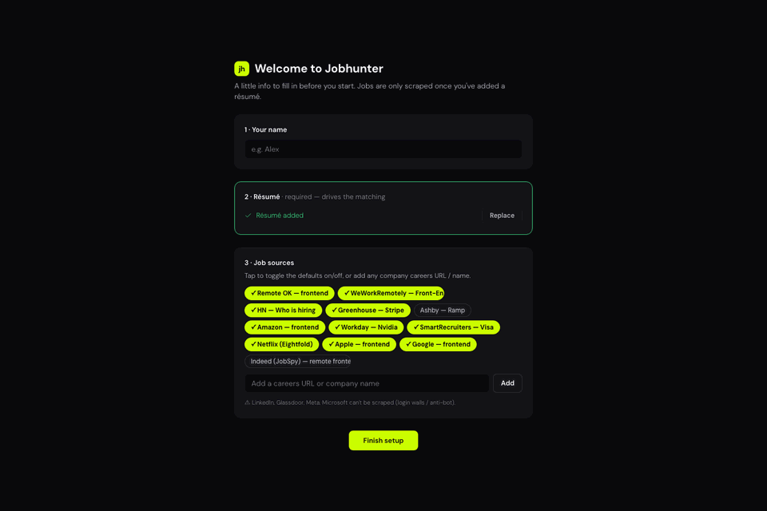
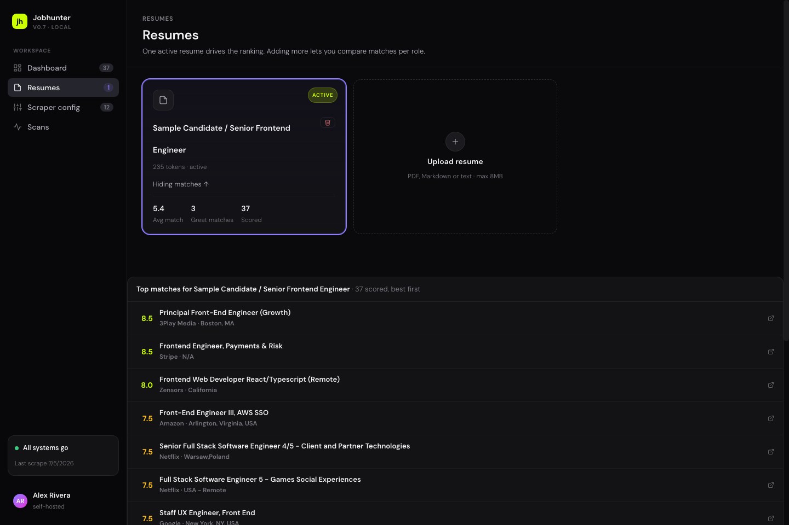
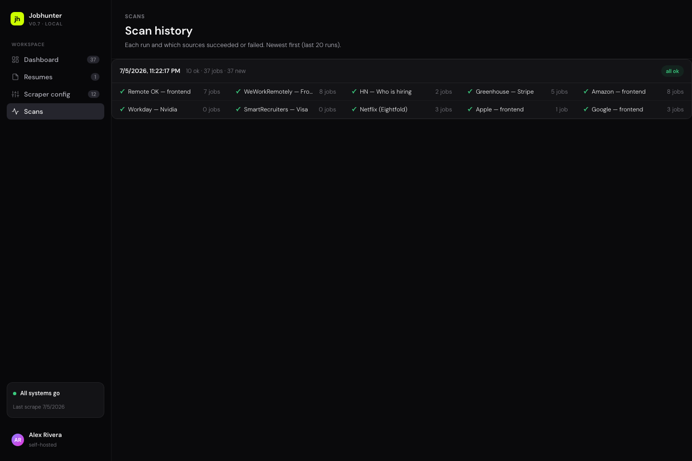
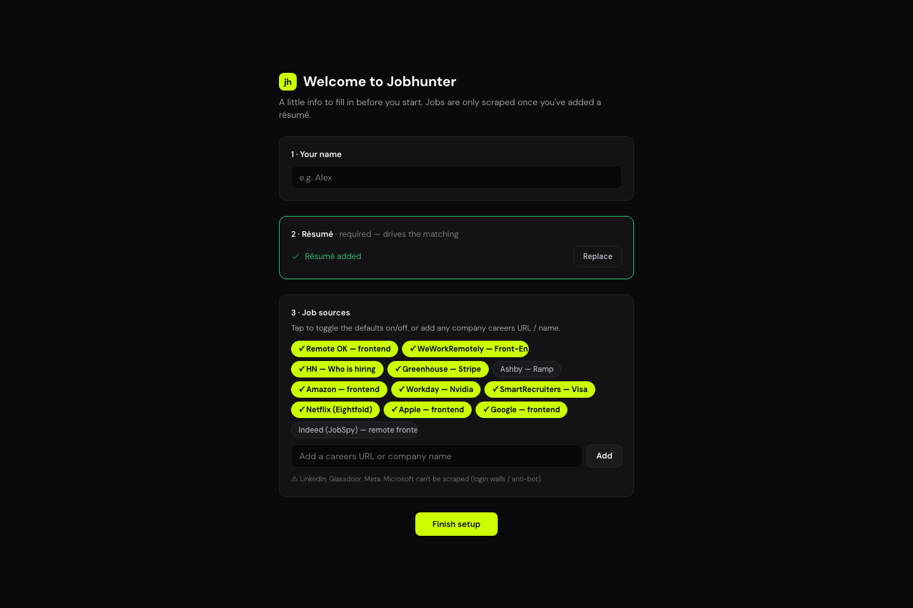

# 🎯 AI Jobhunter

**A local-first job hunter that scrapes real openings, ranks them against your résumé with Claude, and pings you on Telegram when a good match shows up — all on autopilot.**

No LinkedIn scraping, no paid data vendors, no server bill. It pulls straight from free career-site APIs and ATS boards, scores every posting with an LLM, and runs itself daily from a free GitHub Actions cron. Your résumés and match data never leave your machine.



---

## Why

Job boards bury the good roles under hundreds of near-misses, and re-reading the same feed every morning is a chore. AI Jobhunter flips it around: it reads the feeds for you, understands your résumé, and only surfaces what's actually worth your attention — ranked, explained, and ready to apply to.

## What it does

- **Scrapes real jobs from free sources** — hidden career-site JSON APIs (Amazon, Workday tenants, SmartRecruiters), ATS boards (Greenhouse / Lever / Ashby), RSS feeds (WeWorkRemotely), Algolia (Hacker News "Who is hiring"), and Eightfold boards (Netflix). Zero paid infrastructure. Apple and Google are supported too but experimental — they need headless Chrome and time out often.
- **Ranks with Claude** — every posting is scored 0–10 against each of your résumés, with a short "why this score" and the best-matching résumé called out. Seniority is a hard filter; location and work mode softly steer the ranking.
- **Tells you when it matters** — new matches above your threshold get pushed to Telegram. Quiet when there's nothing new.
- **Drafts your application** — one click generates a tailored cover letter and CV tweaks for a specific role (drafter → reviewer pass), using Claude Opus.
- **Tracks your pipeline** — mark jobs applied / interview / archived. The "New" tag clears the moment you open a posting.
- **Runs itself** — a daily GitHub Actions cron scrapes in the cloud (works while your laptop sleeps) and commits the fresh data; your local dashboard just reads it.

## Screens

| Résumé matches | Daily scans |
|---|---|
|  |  |

Click any résumé to see its ranked matches with per-role scores. The **Scans** page shows exactly what ran each day — which sources succeeded, which failed, and the full error on hover — so a broken source is never silent.

First run walks you through onboarding — name, a résumé (no résumé, no scrape), and which job sources to track:



## How it works

```
 free APIs / ATS / RSS / headless Chrome
                │  scrape
                ▼
      filter → dedupe → Claude scoring        seen.json  (new-job memory)
                │                              scans.json (per-run health)
                ▼
          live-data.js  ──►  dashboard (React, served locally)
                │
                └──►  Telegram (new matches ≥ threshold)
```

- **Scraper** — Node 18+, uses built-in `fetch`; zero dependencies for scraping, `@anthropic-ai/sdk` for scoring.
- **Dashboard** — React via CDN + Babel-standalone (no build step). Status/viewed/profile state lives in gitignored local overlays, so the daily cloud pull never conflicts with your local edits.
- **Automation** — `.github/workflows/scrape.yml` runs daily and commits refreshed data.

## Quick start

```bash
cd scraper
npm install
cp .env.example .env      # paste your ANTHROPIC_API_KEY (optional — scraping works without it)
npm run serve             # → http://localhost:8090
```

Open the panel, finish onboarding, and hit **Run now**. Full configuration — adding sources, Telegram setup, daily automation, all the env knobs — is documented in [`scraper/README.md`](scraper/README.md).

> Scoring needs an `ANTHROPIC_API_KEY`. Without one, scraping still runs and jobs get neutral scores.

## What it deliberately doesn't do

LinkedIn, Glassdoor, Indeed (default), Meta, and Microsoft need paid proxies or aggressively block scraping — they're intentionally left out rather than done badly. The panel shows a clear "can't scrape this" warning if you paste one.

---

*Built as a local-first tool. Your résumés, match scores, and application drafts stay on your machine — the only thing that leaves is the API call to Claude for scoring.*
